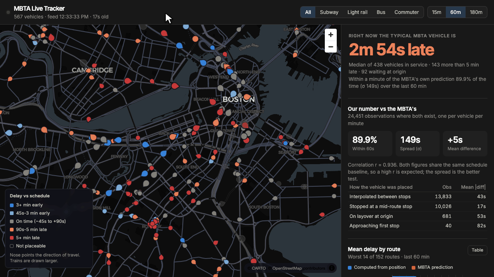
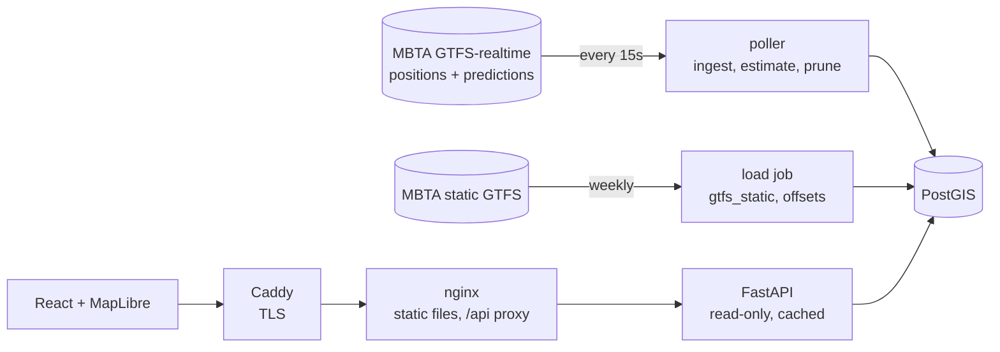

# MBTA Delay Estimator

[](https://github.com/FrankBStack/mbta-delay-estimator/actions/workflows/ci.yml)

**Live at [mbta.frankbs.dev](https://mbta.frankbs.dev).**

Real-time map of Boston transit vehicles. Delays are computed from each
vehicle's physical position against the published timetable, not read from the
agency feed. Over a weekday morning peak the computed figure lands within a
minute of the MBTA's own prediction 90% of the time, with a median difference
of nine seconds; see [Validation](#validation).



GTFS-realtime protobuf feeds are polled into PostGIS by a FastAPI service; a
React + MapLibre frontend consumes the REST API. The MBTA's realtime feeds
require no API key.

**Stack:** Python 3.13, FastAPI, asyncpg, PostgreSQL 17 + PostGIS 3.6, React 18,
MapLibre GL, Vite.

## Deriving delay from position

Two fields are missing from the MBTA's data:

- `TripUpdates` has no `delay` field, only absolute predicted arrival times.
- `shape_dist_traveled` is empty across all 393,561 shape points, so there is no
  published measure of how far along a route a given stop sits.

The second is the bigger problem: without it there's no way to say "this
vehicle is between stops 7 and 8, 40% of the way along". `app.offsets` derives
it instead: `ST_LineLocatePoint` computes, for every distinct (shape, stop)
pair, the fraction along the route line at which that stop falls. That turns
the timetable into a mapping from position to time, so a live vehicle projected
onto its own shape can be compared with when the schedule expected a vehicle at
that point.

The work is keyed on (shape_id, stop_id) rather than (trip_id, stop_sequence).
87,656 trips share only 1,156 shapes, which reduces the geometry operations from
2.2M to roughly 24,000.

All distance computation runs in EPSG:26986 (NAD83 / Massachusetts Mainland, in
metres) rather than WGS84 degrees, which would bias placement east-west at
Boston's latitude.

### Placing a vehicle on its route

`ST_LineLocatePoint` returns the first nearest point on the line, so on a loop
route a vehicle on its second pass resolves to a position near the start. The
feed's `current_stop_sequence` picks which leg the vehicle is on, and the
fraction locates it along that leg. Each observation records how it was placed:

| Method | Description |
|---|---|
| `interpolated` | In transit; scheduled time prorated along the shape between two stops |
| `stopped_at` | Stopped at a mid-route stop; the deviation at the moment it arrived, held for the dwell |
| `layover` | Stopped at the trip's first stop; measured against scheduled departure, floored at zero |
| `first_stop` | Approaching the first stop, with no preceding stop to interpolate from; floored at zero |

A vehicle sitting at a stop is measured once, when it first reports itself
stopped, rather than reading one second later for every second it dwells.
Observations far from their shape or implausibly late are kept but flagged low
confidence and left out of the analytics. [docs/design.md](docs/design.md) has
the full placement and confidence rules.

## Validation

Since the MBTA publishes no delay field, its figure is derived for comparison
from the same trip and stop: predicted arrival against scheduled arrival, or
predicted departure against scheduled departure for a vehicle on layover. They
answer different questions (ours is how late a vehicle is right now, theirs is
how late it will be on arrival), so they diverge most at peak service.

Measured on Wednesday 16 September 2026, thinned to one observation per vehicle
per minute:

| | Morning peak (07:00–09:10) | Overnight (00:17–05:00) |
|---|---:|---:|
| Paired observations | 80,535 | 14,032 |
| Distinct vehicles | 831 | 358 |
| Median divergence | +9s | +7s |
| p10 / p90 | −12s / +52s | −12s / +42s |
| Within 60s of feed | 90.0% | 93.0% |
| Within 120s of feed | 96.6% | 98.1% |

The comparison has caught three estimator bugs so far. Scoring the same
observations before and after the two most recent fixes, the dwell hold and
its cap, moved the share within 60s at peak from 85.0% to 90.0%, cut the
stopped-at class's mean absolute divergence from 30s to 10s, and brought the
spread from σ 67s to 63s. [docs/validation.md](docs/validation.md) has the
before-and-after tables, the cap values tried, the breakdown by service level
and placement method, and the earlier first-stop bug.

## API

| Endpoint | Returns |
|---|---|
| `GET /api/vehicles` | Live positions as GeoJSON, with both delay figures |
| `GET /api/vehicles/{id}/history` | Breadcrumb trail with per-point delay |
| `GET /api/routes` | Route list, optionally limited to those currently running |
| `GET /api/routes/{id}/shape` | Route geometry as GeoJSON |
| `GET /api/analytics/delay-by-route` | Mean delay per route, computed vs. feed |
| `GET /api/analytics/divergence` | Agreement statistics, broken down by method |
| `GET /api/analytics/timeline` | Both series bucketed over time |
| `GET /api/analytics/health` | Poller liveness and data volume |

Interactive documentation at `/docs`.

## How it fits together



Only the poller writes realtime rows; the API reads. The two run as separate
containers so API replicas never double-poll.

## Project layout

```
backend/app/
  schema.sql        tables, indexes, and the gtfs_ts() time helper
  gtfs_static.py    GTFS zip into PostGIS via streaming COPY
  offsets.py        ST_LineLocatePoint stop-position cache
  backfill.py       recompute observations from stored positions
  services/
    realtime.py     GTFS-realtime poller
    delay.py        the schedule join and comparison
  routers/          vehicles, routes, analytics
backend/tests/      the estimator run against a synthetic route in PostGIS
frontend/src/
  components/MapView.jsx            MapLibre map, diverging delay scale
  components/DelayByRouteChart.jsx  two-series comparison chart
  lib/delay.js                      color scale shared by map and legend
```

## Running with Docker

```bash
docker compose up -d --build           # PostGIS, API, poller, and the frontend on localhost:8080
docker compose run --rm load           # downloads and loads the feed, ~60s; repeat weekly
```

The API and poller start before the feed has been loaded; vehicles carry no
delay until `load` finishes.

## Running locally

Requires PostgreSQL with PostGIS, Python 3.11+, and Node 22+.

```bash
brew install postgresql@17 postgis
brew services start postgresql@17
createdb tracker
psql -d tracker -c "CREATE EXTENSION postgis;"

cd backend
python3 -m venv .venv && .venv/bin/pip install -r requirements.txt
cp .env.example .env
.venv/bin/python -m app.gtfs_static     # downloads and loads the feed, ~60s
.venv/bin/uvicorn app.main:app --port 8010
```

```bash
cd frontend
npm install && npm run dev              # localhost:5173
```

### Tests

```bash
cd backend
.venv/bin/pip install -r requirements-dev.txt
.venv/bin/python -m pytest        # estimator rules; creates a tracker_test DB

cd frontend
npm test                          # delay scale, formatting, chart helpers
```

CI runs both suites and builds the Docker images on every push.

## Deployment

The poller writes and the API only reads, so in production they run as
separate processes: any number of API replicas with `RUN_POLLER=false`, and
exactly one poller. [docs/operations.md](docs/operations.md) covers the
commands, the weekly feed reload, and backfilling after an estimator change.

## Known limitations

- Delay computation requires `current_stop_sequence`. Vehicles reporting a
  position without one appear on the map unfilled, carrying no delay figure.
- Trips added in realtime (`schedule_relationship: ADDED`) and replacement
  shuttles have no static schedule to compare against. They are drawn without
  a delay and the map says which case applies. The Green Line often runs
  mostly as added trips: on a Saturday evening with a rail diversion, 297 of
  371 vehicles could be scored and only 2 of 26 light rail vehicles were among
  them, so the headline median under-represents light rail at those times.
  Every vehicle running a scheduled trip was placed.
- Fleet size varies by a factor of three across the service day (231 distinct
  vehicles overnight against 765 at morning peak), and agreement with the feed
  is measurably weaker at peak. Any single-window figure should be read against
  the service level it was sampled from.
- The feed comparison is null when no prediction falls within five minutes of an
  observation, rather than reaching for a more distant one. Those rows still
  carry a computed delay, just nothing to compare it against.
- The projection is specific to Massachusetts. Targeting another city means
  changing the SRID, not only the feed URLs.
