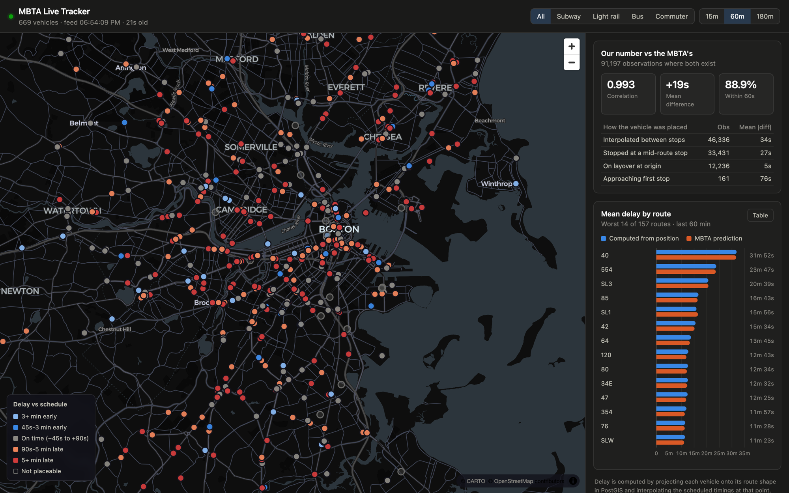

# MBTA Delay Estimator

Real-time Boston transit vehicles rendered on a map, with delays derived from
each vehicle's physical position against the published timetable rather than
read from the agency feed.

Validated against the agency's own predictions: over a weekday evening peak —
744 vehicles, 157 routes, 87k paired observations — the two figures agree at
r = 0.99, mean difference +19s, 89% within 60 seconds. The divergence that
remains is mostly definitional; the validation section below measures it and
traces where it comes from.



GTFS-realtime protobuf feeds are polled into PostGIS by a FastAPI service; a
React + MapLibre frontend consumes the REST API. The MBTA's realtime feeds
require no API key.

**Stack:** Python 3.13, FastAPI, asyncpg, PostgreSQL 17 + PostGIS 3.6, React 18,
MapLibre GL, Vite.

## Deriving delay from position

Two fields the MBTA does not publish shape the design of this component:

- `TripUpdates` contains no `delay` field, only absolute predicted arrival times.
- `shape_dist_traveled` is empty across all 393,561 shape points, so there is no
  published measure of how far along a route a given stop sits.

The second omission is the bigger problem: without it there's no way to say
"this vehicle is between stops 7 and 8, 40% of the way along", which is exactly
what inferring delay from a position needs. `app.offsets` derives the measure instead:
`ST_LineLocatePoint` computes, for every distinct (shape, stop) pair, the
fraction along the route line at which that stop falls. This reduces the
timetable to a mapping from position to time, which can then be inverted —
project a live vehicle onto its own shape and read off when the schedule expects
a vehicle at that point.

The work is keyed on (shape_id, stop_id) rather than (trip_id, stop_sequence).
87,656 trips share only 1,156 shapes, which reduces the geometry operations from
2.2M to roughly 24,000.

All distance computation runs in EPSG:26986 (NAD83 / Massachusetts Mainland, in
metres) rather than WGS84 degrees. At Boston's latitude a degree of longitude is
approximately 0.74 of a degree of latitude, so locating a point on a line in
unprojected coordinates biases the result east-west.

### Placing a vehicle on its route

A fraction alone isn't enough. `ST_LineLocatePoint` returns the first nearest
point on the line, so on a loop route a vehicle on its second pass resolves to a
position near the start. This affects 2.6% of MBTA trips, flagged at load time
as `frac_monotonic = false`. The feed's `current_stop_sequence` determines which
leg the vehicle occupies; the geometry then locates it along that leg.

Each observation records the method used, so any suspect value can be traced
back to its derivation:

| Method | Description |
|---|---|
| `interpolated` | In transit; scheduled time prorated along the shape between two stops |
| `stopped_at` | Stopped at a mid-route stop; that stop's scheduled time exactly |
| `layover` | Stopped at the trip's first stop (see below) |
| `first_stop` | Approaching the first stop, with no preceding stop to interpolate from |

Observations are marked low confidence where the vehicle sits more than 150m
from the shape it reports running, or where the result exceeds three hours —
typically indicating a mismatched service date. These are retained but excluded
from analytics by default.

Stop-to-shape snap error across the loaded feed: mean 7.0m, p95 11.9m.

## Validation against the agency's predictions

Because the MBTA publishes no delay field, its column is derived here as
predicted arrival minus scheduled arrival for the same trip and stop. The two
figures answer different questions — ours is how late a vehicle is right now,
theirs how late it will be on arrival — so the interesting part is where and
why they diverge.

The tables below predate a correction to the feed join (`with_feed` in
`app/services/delay.py`), which took the newest prediction for a stop rather
than the contemporaneous one, so treat their exact figures as approximate;
they're kept because they document how the estimator was debugged. Re-measured
after the correction over a weekday evening peak: correlation 0.9935, mean
divergence +19s, σ 50s, 88.8% within 60s (87,461 compared observations).

That comparison caught a real bug in the first version of the estimator. Broken down by
placement method, mid-route stops agreed with the agency to within 16 seconds,
but vehicles stopped at the first stop of their trip resolved to 323 seconds
early on average while the feed reported them on time.

Neither number was wrong; they were measuring different things. A bus sitting
at its origin at 04:55 ahead of an 05:00 departure really has arrived five
minutes before that stop's scheduled time — but it won't leave early, so calling
it five minutes early is meaningless.

Vehicles at their first stop are now measured against scheduled *departure*,
floored at zero. Mid-route stops retain the signed comparison, since a vehicle
running a timepoint two minutes early is genuinely early and passengers miss it.

Recomputed over the same observations with the same feed values, changing only
the estimator:

| Metric | Before | After |
|---|---|---|
| Correlation with feed | 0.851 | 0.985 |
| Mean divergence | −47s | +6s |
| Standard deviation | 166s | 45s |
| Within 60s of feed | 76.4% | 92.2% |

The layover class alone moved from −323s mean divergence to −8s.

### Agreement across service levels

Measured over a continuous run on Tuesday 28 July 2026, split between overnight
service and the weekday morning peak:

| | Overnight (00:17–05:00) | Morning peak (07:00–09:10) |
|---|---:|---:|
| Observations | 13,126 | 7,751 |
| Distinct vehicles | 231 | 765 |
| Routes | 92 | 166 |
| Mean delay (computed) | 129s | 162s |
| Correlation with feed | 0.9916 | 0.9597 |
| Mean divergence | +11s | +23s |
| Standard deviation | 45s | 84s |
| Within 60s of feed | 92.9% | 87.1% |

Agreement is noticeably weaker at peak. Service is later on average, and the
spread between the two methods roughly doubles. Both effects are expected:
congestion and passenger boarding introduce variance that a position-derived
figure and a forward-looking prediction absorb differently.

The residual isn't noise, though: predictions bake in expected recovery —
schedule padding, time made up on an express segment — so the position-derived
figure reads consistently later.

Breaking the peak window down by placement method locates most of that spread:

| Method | Observations | Mean divergence | Mean absolute divergence |
|---|---:|---:|---:|
| `interpolated` | 3,762 | +18s | 35s |
| `stopped_at` | 2,764 | +43s | 47s |
| `layover` | 1,209 | −1s | 3s |
| `first_stop` | 16 | −127s | 127s |

`stopped_at` accounts for the bulk of it. While a vehicle sits at a stop our
figure keeps growing, since it is measured against that stop's scheduled arrival
and time continues to pass; the agency has already recorded the arrival and
moved its prediction to the next stop. Long peak dwells widen the gap. The gap
is inherent to the two definitions, not a bug.

`layover` stays at 3s mean absolute divergence even under peak load — good
evidence the departure-based rule is right.

Individual routes show the effect more sharply. At peak, route 504 measured
13m36s late by position against a 12m24s prediction; earlier, in an overnight
window, route 8 measured 8m42s late while the MBTA predicted arrival 1m18s
early, implying roughly ten minutes of expected recovery before its next
timepoint.

## API

| Endpoint | Returns |
|---|---|
| `GET /api/vehicles` | Live positions as GeoJSON, with both delay figures |
| `GET /api/vehicles/{id}/history` | Breadcrumb trail with per-point delay |
| `GET /api/routes` | Route list, optionally limited to those currently running |
| `GET /api/routes/{id}/shape` | Route geometry as GeoJSON |
| `GET /api/analytics/delay-by-route` | Mean delay per route, computed vs. feed |
| `GET /api/analytics/divergence` | Agreement statistics, broken down by method |
| `GET /api/analytics/timeline` | Both series bucketed over time |
| `GET /api/analytics/health` | Poller liveness and data volume |

Interactive documentation at `/docs`.

## Project layout

```
backend/app/
  schema.sql        tables, indexes, and the gtfs_ts() time helper
  gtfs_static.py    GTFS zip into PostGIS via streaming COPY
  offsets.py        ST_LineLocatePoint stop-position cache
  services/
    realtime.py     GTFS-realtime poller
    delay.py        the schedule join and comparison
  routers/          vehicles, routes, analytics
backend/tests/      the estimator run against a synthetic route in PostGIS
frontend/src/
  components/MapView.jsx            MapLibre map, diverging delay scale
  components/DelayByRouteChart.jsx  two-series comparison chart
  lib/delay.js                      color scale shared by map and legend
```

## Running locally

Requires PostgreSQL with PostGIS, Python 3.11+, and Node 18+.

```bash
brew install postgresql@17 postgis
brew services start postgresql@17
createdb tracker
psql -d tracker -c "CREATE EXTENSION postgis;"

cd backend
python3 -m venv .venv && .venv/bin/pip install -r requirements.txt
cp .env.example .env
.venv/bin/python -m app.gtfs_static     # downloads and loads the feed, ~60s
.venv/bin/uvicorn app.main:app --port 8010
```

```bash
cd frontend
npm install && npm run dev              # localhost:5173
```

The static load handles 2.2M stop_times, 1,156 route shapes, and 2.2M derived
stop offsets. Re-run it when the MBTA publishes a new feed (roughly weekly); it
drops and rebuilds every table.

### Tests

```bash
cd backend
.venv/bin/pip install -r requirements-dev.txt
.venv/bin/python -m pytest        # estimator rules; creates a tracker_test DB

cd frontend
npm test                          # delay scale, formatting, chart helpers
```

## Deployment

The poller writes; the API only reads. In production they run as separate
processes, because a poller embedded in the API means every replica polls the
same feeds and writes the same rows.

```bash
RUN_POLLER=false uvicorn app.main:app --port 8010   # API, any number of these
python -m app.poller                                # exactly one of these
```

`RUN_POLLER` defaults to true so a single local process still works unchanged.
The poller records its state to `feed_meta` each cycle, so `/api/analytics/health`
reports the real poller regardless of which process it runs in.

| Concern | Handling |
|---|---|
| Load balancer probe | `GET /healthz` — one `SELECT 1`. `/api/analytics/health` runs unbounded counts and is diagnostic only |
| Read load | Responses cached for `CACHE_TTL_S` (default 5s), so database load follows the poll interval rather than request volume |
| CORS | Unnecessary if the built frontend and the API share an origin behind one reverse proxy; the frontend calls `/api` relatively. Otherwise set `CORS_ORIGINS` |
| Interactive docs | `ENABLE_DOCS=false` removes `/docs`, `/redoc`, and `/openapi.json` |
| Disk | ~7 GB steady state. Alert on table size: a stalled prune is silent otherwise |

Re-running `app.gtfs_static` drops and rebuilds every table, so the weekly feed
reload is an outage — vehicles render without delays until the offsets finish.
Build into a new schema and swap if that window matters.

## Known limitations

- Delay computation requires `current_stop_sequence`. Vehicles reporting a
  position without one appear on the map unfilled, carrying no delay figure.
- Trips added in realtime (`schedule_relationship: ADDED`) have no static
  schedule to compare against and are skipped by the estimator.
- Fleet size varies by a factor of three across the service day (231 distinct
  vehicles overnight against 765 at morning peak), and agreement with the feed
  is measurably weaker at peak. Any single-window figure should be read against
  the service level it was sampled from.
- `PROJECTED_SRID` is specific to Massachusetts. Targeting another city requires
  selecting the appropriate local metre-based CRS, not only changing the feed
  URLs.
- `npm audit` reports advisories in Vite's toolchain. They affect the
  development server rather than the production bundle, and the dev server binds
  to 127.0.0.1. Re-check rather than trusting this line; the set changes.
- `backend/tests` covers the estimator's rules — the layover floor,
  interpolation, ratio clamping, the feed join, the confidence flags — against
  a synthetic route in a real PostGIS database. The static loader and the
  poller are exercised only by running them.
- The feed comparison is null when no prediction falls within five minutes of an
  observation, rather than reaching for a more distant one. Those rows still
  carry a computed delay, just nothing to compare it against.
- Read endpoints are cached for `CACHE_TTL_S`, so a response can trail the
  poller by a few seconds on top of the feed's own age.
